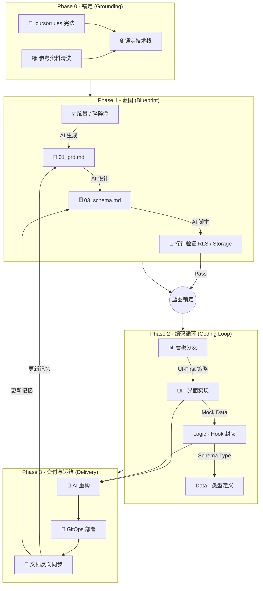

这是一个集大成之作。我们将之前所有碎片化的讨论（原理、定义、流程、规范、技巧）通过**“Vibe Coding 实施全案”**的形式进行结构化输出。

这份文档可以直接作为团队内部的**工程白皮书**或个人的**开发手册**。


> 核心理念：将人类从“代码工匠”升级为“系统园丁”。
> 
> 适用场景：单兵作战 / MVP 开发 / 独立开发者 / 内部工具。
> 
> 技术基座：Next.js (App Router) + Supabase + Vercel (or Coolify)。

---

## 第一章：定义与边界 (The Definition)

在开始之前，必须向 AI 和自己明确“我们在做什么”。

### 1. 什么是“小型软件”？

不是功能简陋，而是**认知可控**。一个自然人能完全掌握所有逻辑和架构。

- **架构维度**：**去中间商 (No Intermediaries)**。拒绝微服务，拒绝 Docker 编排。
    
- **数据维度**：**单一真理源**。前端直连 BaaS，无中间后端 API 层。
    
- **协作维度**：**文档即交互**。文档是 AI 的外挂显存，前后端通过 Schema 自动对齐。
    

### 2. 负向约束 (Negative Constraints)

_为了防止 AI 只有“企业级”肌肉记忆，必须设定红线：_

|**维度**|**小型软件 (Vibe Coding)**|**❌ 严禁 (企业级幻觉)**|
|---|---|---|
|**架构**|单体 (Monolith)|微服务 / 分布式 / K8s|
|**通信**|SDK 直连 (Direct Access)|RESTful API 网关 / BFF 层|
|**依赖**|原生优先 (Native First)|滥用库 (Axios, Moment, Lodash)|
|**任务**|原子化 (Atomic)|一次性生成整个模块|
|**部署**|GitOps (Push to Deploy)|手写 CI/CD 流水线 / Dockerfile|

---

## 第二章：全链路工作流 (The Workflow)

Code snippet




## 第三章：工程规范 (Engineering Standards)

### 1. 目录结构 (The Skeleton)

_物理隔离上下文，强制模块化。_

Plaintext

```
root/
├── .cursorrules               # [宪法] 技术栈与行为准则
├── docs/                      # [大脑] AI 只读区 & 记忆区
│   ├── references/            # [输入] 官方 API 摘录、技术栈规则
│   └── specs/                 # [输出] PRD, Schema, UI设计, 状态看板
├── src/                       # [手脚] 代码实现区
│   ├── app/                   # 页面 (Server Components)
│   ├── components/            # 组件 (UI Only)
│   ├── lib/                   # 逻辑 (Hooks, Utils, Supabase Client)
│   └── types/                 # 类型 (Database Types)
├── supabase/                  # 数据库配置
│   └── migrations/            # SQL 变更记录
└── scripts/                   # [工具] Spike 验证脚本
```

### 2. 状态驱动开发 (Status-Driven)

_严禁跳过看板直接写代码。_

- **看板位置**：`docs/specs/04_dev_status.md`
    
- **原子任务粒度**：D-L-U 原则 (Data -> Logic -> UI)。一个任务涉及文件 < 3 个。
    

### 3. 数据库设计规范 (Schema Rules)

- **反范式**：能合表就合表，配置类数据存 `JSONB`。
    
- **拒字典**：状态字段直接存字符串，不用关联表。
    
- **UUID**：主键必须是 `gen_random_uuid()`。
    
- **真删除**：不搞 `is_deleted`，直接 Delete。
    

---

## 第四章：关键战术与技巧 (Tactics)

### 1. 准备阶段：The Spike (探针)

- **What**：在写业务代码前，先写独立脚本验证“硬骨头”。
    
- **Where**：`scripts/spike_schema.ts` (测 RLS), `scripts/spike_storage.ts` (测图片上传)。
    
- **Why**：排除 90% 的权限和配置错误，避免在写 UI 时 debug 后端。
    

### 2. 开发阶段：UI-First (UI 优先)

- **逻辑**：用“看得见”的界面反推“看不见”的数据。
    
- **步骤**：
    
    1. **Static Shell**：只写 HTML/Tailwind，确认长相。
        
    2. **Mock Data**：定义 Props 和 JSON 数据，确认接口契约。
        
    3. **Hydration**：替换为真实 Hook，接入 Supabase。
        

### 3. 维护阶段：Vibe Refactoring (AI 重构)

- **触发线**：单文件 > 200 行，或 Token 溢出。
    
- **手段**：
    
    - **细胞分裂**：大组件拆小组件。
        
    - **逻辑抽取**：`useEffect` 抽成 Custom Hook。
        
- **原则**：Behavior Preserving (不改变行为)。
    

### 4. 结束阶段：Exit Handshake (文档保鲜)

- **规则**：任务结束前，必须反问：“代码改了，文档改了吗？”
    
- **操作**：
    
    - Schema 变了 -> `supabase db diff` -> 更新 `03_schema.md`。
        
    - 逻辑变了 -> 更新 `01_prd.md`。
        

---

## 第五章：Prompt 资产库 (The Kit)

_复制这些 Prompt，让 AI 为你打工。_

### 🛠️ 1. 初始化宪法 (.cursorrules)

> "Role: Senior Engineer for Small-Scale Software. Stack: Next.js + Supabase. Constraints: No Microservices, No Docker, No Redux. Workflow: Read `docs/specs/04_dev_status.md` first."

### 📝 2. PRD 生成器 (Brain Dump -> Spec)

> "System: Expert Product Manager. Action: Convert my rough ideas into a Markdown PRD. Structure: Core Philosophy, User Stories (MVP), UI/UX Flow, Tech Constraints (Vibe Coding rules)."

### 🏗️ 3. Schema 生成器 (PRD -> SQL)

> "Task: Design Supabase Schema based on PRD. Constraints: Merge tables where possible, use JSONB for settings, use UUIDs, enable RLS. Output: SQL DDL."

### 🧪 4. Spike 生成器 (Verification)

> "Task: Create a standalone TS script to verify Storage RLS. Steps: Login test user, upload dummy file, get signed URL. Log success/fail."

### 🧹 5. 重构指令 (Refactor)

> "Task: Extract logic from `Chat.tsx` to `useChat.ts`. Constraint: Do NOT change logic behavior or UI styles. Just clean up the code."

---

这份全案将 **软件工程的严谨性** 与 **AI 编程的灵活性** 结合，构成了 Vibe Coding 的完整闭环。祝您编码愉快！