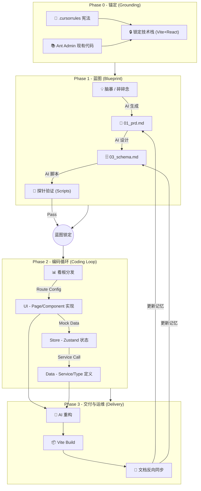

这是一个集大成之作。我们将之前所有碎片化的讨论（原理、定义、流程、规范、技巧）通过\*\*“Vibe Coding 实施全案”\*\*的形式进行结构化输出。

这份文档可以直接作为团队内部的**工程白皮书**或个人的**开发手册**。

> 核心理念：将人类从“代码工匠”升级为“系统园丁”。
>
> 适用场景：单兵作战 / MVP 开发 / 独立开发者 / 内部工具。
>
> 技术基座：**Vite (React SPA) + Ant Design 5 + Zustand + Supabase**。

-----

## 第一章：定义与边界 (The Definition)

在开始之前，必须向 AI 和自己明确“我们在做什么”。

### 1\. 什么是“小型软件”？

不是功能简陋，而是**认知可控**。一个自然人能完全掌握所有逻辑和架构。

  - **架构维度**：**SPA 单页应用 (Single Page Application)**。完全静态化前端，直连数据库。
  - **数据维度**：**单一真理源**。前端直连 Supabase，无中间后端 Node 层。
  - **协作维度**：**文档即交互**。文档是 AI 的外挂显存，前后端通过 Schema 自动对齐。

### 2\. 负向约束 (Negative Constraints)

*为了防止 AI 只有“企业级”肌肉记忆，必须设定红线：*

| **维度** | **小型软件 (Vibe Coding)** | **❌ 严禁 (企业级幻觉)** |
| :--- | :--- | :--- |
| **架构** | 客户端渲染 (CSR) | 服务端渲染 (SSR) / Next.js Server Actions |
| **路由** | 集中式配置 (`routes.tsx`) | 文件系统路由 (Next.js App Router) |
| **通信** | Service 层直连 (Direct SDK) | RESTful API 网关 / BFF 层 |
| **状态** | Zustand (原子化 Store) | Redux / Context API 滥用 |
| **依赖** | 优先复用 AntD 组件 | 手写复杂 CSS / 引入重复 UI 库 |
| **部署** | 静态托管 (Dist -\> Nginx/Vercel) | Docker 容器编排 / K8s |

-----

## 第二章：全链路工作流 (The Workflow)



-----

## 第三章：工程规范 (Engineering Standards)

### 1\. 目录结构 (The Skeleton)

*基于 Ant Admin Starter 的标准结构，严禁随意新增顶层目录。*

```text
root/
├── .cursorrules               # [宪法] 技术栈与行为准则
├── docs/                      # [大脑] AI 只读区 & 记忆区
│   ├── references/            # [输入] 官方 API 摘录
│   └── specs/                 # [输出] PRD, Schema, UI设计, 状态看板
├── src/                       # [手脚] 代码实现区
│   ├── config/                # [路由] routes.tsx, menu.tsx
│   ├── pages/                 # [页面] 业务页面入口 (Page Level)
│   ├── components/            # [组件] 通用/局部组件 (UI Only)
│   ├── store/                 # [状态] Zustand Stores
│   ├── services/              # [逻辑] Supabase 数据交互层
│   ├── types/                 # [类型] Database Types
│   └── utils/                 # [工具] Helpers
├── supabase/                  # 数据库配置
│   └── migrations/            # SQL 变更记录
└── scripts/                   # [工具] Spike 验证脚本
```

### 2\. 状态驱动开发 (Status-Driven)

*严禁跳过看板直接写代码。*

  - **看板位置**：`docs/specs/04_dev_status.md`
  - **原子任务粒度**：D-S-U 原则 (Data -\> Store -\> UI)。
    1.  **D (Data)**: 定义 `types/index.ts` 和 `services/xxxService.ts`。
    2.  **S (Store)**: (可选) 定义 `store/xxxStore.ts` 处理跨组件状态。
    3.  **U (UI)**: 在 `pages/` 创建页面，并在 `config/routes.tsx` 注册。

### 3\. 数据库设计规范 (Schema Rules)

  - **反范式**：能合表就合表，配置类数据存 `JSONB`。
  - **UUID**：主键必须是 `gen_random_uuid()`。
  - **RLS**：必须开启 Row Level Security，但在 MVP 阶段可设为 `Generic Policy` (允许 authenticated 读写)。

-----

## 第四章：关键战术与技巧 (Tactics)

### 1\. 准备阶段：The Spike (探针)

  - **What**：独立脚本验证“硬骨头”。
  - **Where**：`scripts/spike_feishu_sync.ts` (测接口), `scripts/spike_storage.ts` (测上传)。
  - **Why**：Vite 环境调试后端逻辑（Cron/Edge Functions）比较麻烦，先用脚本跑通。

### 2\. 开发阶段：SPA Routing (路由优先)

  - **逻辑**：Vite SPA 是基于路由配置的，不是文件系统。
  - **步骤**：
    1.  **Page Shell**：在 `src/pages/` 下新建空组件 `TargetPage/index.tsx`。
    2.  **Route Register**：在 `src/config/routes.tsx` 中添加路径。
    3.  **Menu Config**：在 `src/config/menu.tsx` 中添加侧边栏入口。
    4.  **Implementation**：填充页面逻辑。

### 3\. 维护阶段：Vibe Refactoring (AI 重构)

  - **触发线**：单文件 \> 200 行，或 `useEffect` 依赖混乱。
  - **手段**：
      - **Service 抽离**：将 `supabase.from()...` 逻辑全部移入 `src/services/`。
      - **Store 抽离**：将复杂的 `useState` 组合移入 `zustand` store。
  - **原则**：不改变 UI 表现，只优化数据流。

-----

## 第五章：Prompt 资产库 (The Kit)

*复制这些 Prompt，让 AI 为你打工。*

### 🛠️ 1. 初始化宪法 (.cursorrules)

> "Role: Senior Frontend Architect. Stack: Vite + React + TypeScript + Ant Design 5 + Zustand + Supabase. Constraints: SPA Architecture (No SSR), use `src/services` for API calls, use `src/config/routes.tsx` for routing. Workflow: Read `docs/specs/04_dev_status.md` first."

### 📝 2. PRD 生成器 (Brain Dump -\> Spec)

> "System: Expert Product Manager. Action: Convert my rough ideas into a Markdown PRD. Structure: Core Philosophy, User Stories (MVP), UI/UX Flow (AntD Components), Data Structure (Supabase). Output: `docs/specs/01_prd.md`."

### 🏗️ 3. Schema 生成器 (PRD -\> SQL)

> "Task: Design Supabase Schema based on PRD. Constraints: Merge tables where possible, use JSONB for settings, use UUIDs. Output: SQL DDL for Supabase SQL Editor."

### 💻 4. 编码指令 (Feature Implementation)

> "Task: Implement the 'Bot Management' feature.
> Steps:
>
> 1.  Define types in `src/types/index.ts`.
> 2.  Create `src/services/botService.ts` for Supabase CRUD.
> 3.  Create `src/pages/BotConfig/index.tsx` using AntD Table and Form.
> 4.  Register route in `src/config/routes.tsx`.
>     Reference: `docs/specs/01_prd.md`."

### 🧹 5. 重构指令 (Refactor)

> "Task: Refactor `src/pages/Chat/index.tsx`.
> Goal: Move data fetching logic to `src/services/chatService.ts` and state management to `src/store/chatStore.ts`. Keep the UI exactly the same."